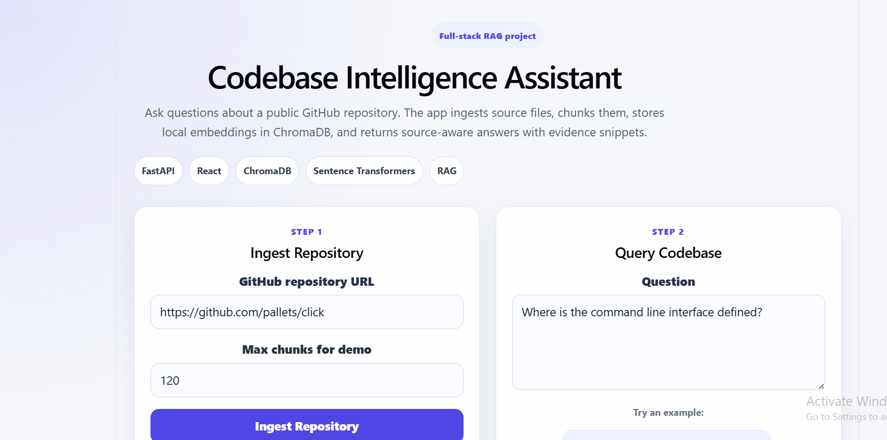

\# Codebase Intelligence Assistant


A full-stack RAG application that lets users ask natural-language questions about public GitHub repositories.


The system ingests repository files, chunks source code and documentation, creates local embeddings, stores them in ChromaDB, retrieves relevant chunks for a question, and returns a source-aware answer with evidence snippets.


\## Features


\- Public GitHub repository ingestion

\- Source file loading and filtering

\- Code/document chunking with metadata

\- Local embeddings using Sentence Transformers

\- ChromaDB vector search

\- Source-aware answer generation

\- FastAPI backend with `/ingest`, `/query`, `/stats`, and `/health`

\- React + TypeScript frontend

\- API testing script

\- Basic retrieval evaluation script


\## Tech Stack


\*\*Backend\*\*

\- Python

\- FastAPI

\- ChromaDB

\- Sentence Transformers

\- GitPython

\- pandas-style data workflow patterns


\*\*Frontend\*\*

\- React

\- TypeScript

\- Vite

\- CSS


\## Architecture


```text

GitHub Repository URL

&#x20;       ↓

Repository Cloning

&#x20;       ↓

File Loading and Filtering

&#x20;       ↓

Chunking with Metadata

&#x20;       ↓

Local Embeddings

&#x20;       ↓

ChromaDB Vector Store

&#x20;       ↓

Semantic Retrieval

&#x20;       ↓

Source-aware Answer

&#x20;       ↓

React UI

## Demo Screenshots

### Main Interface



### Repository Ingestion


### Source-aware Answer


### Retrieved Evidence


